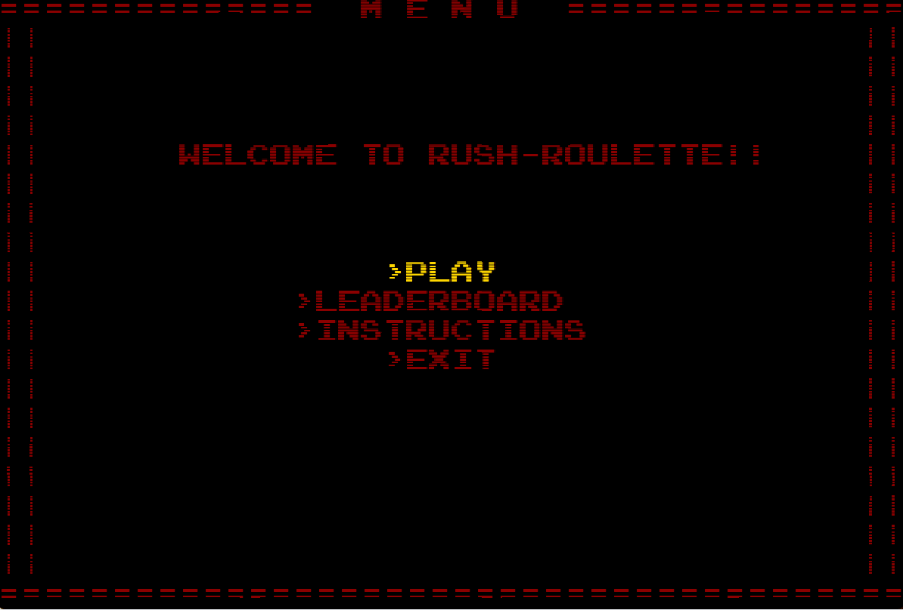
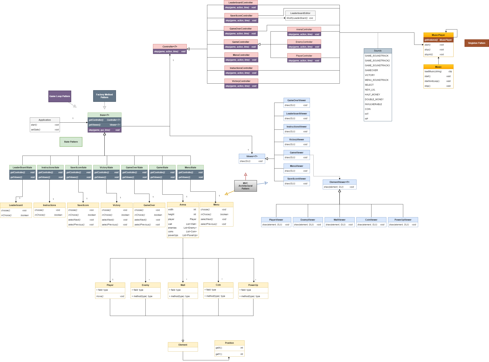
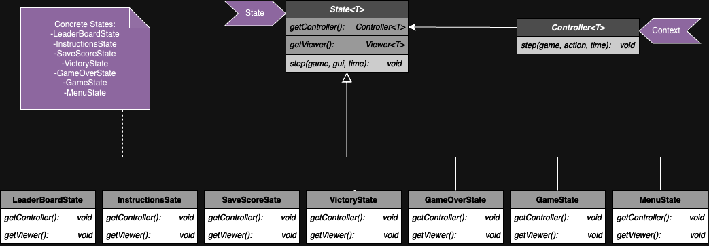
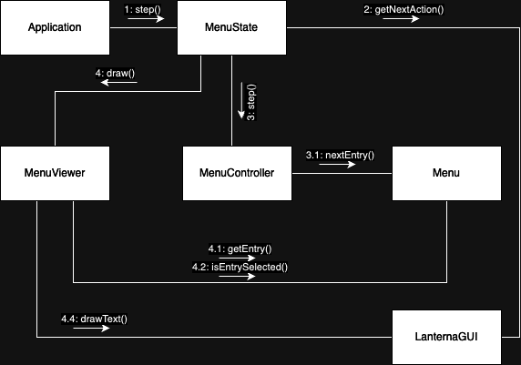
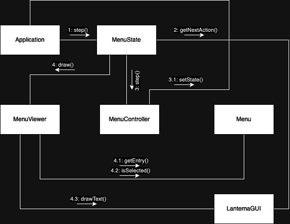
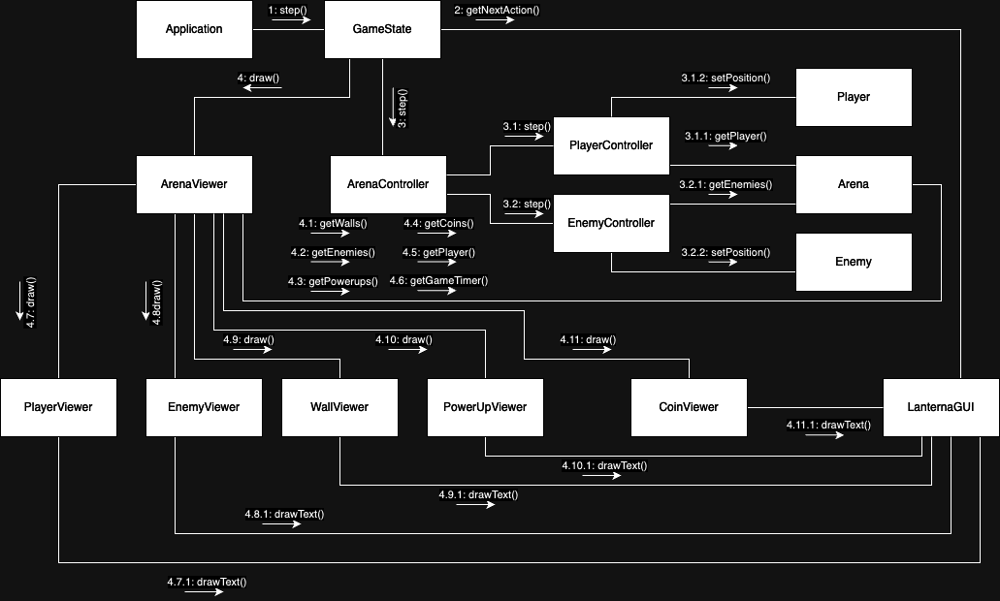
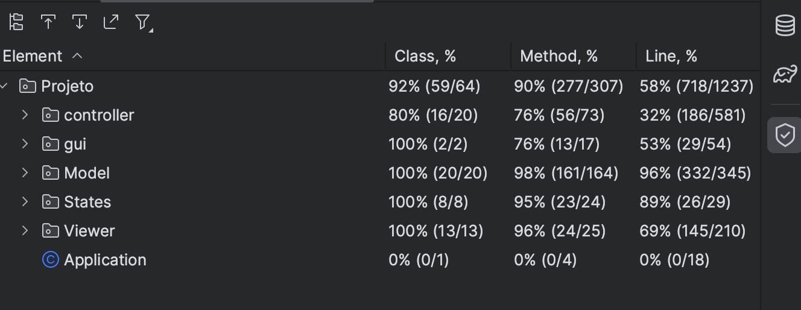
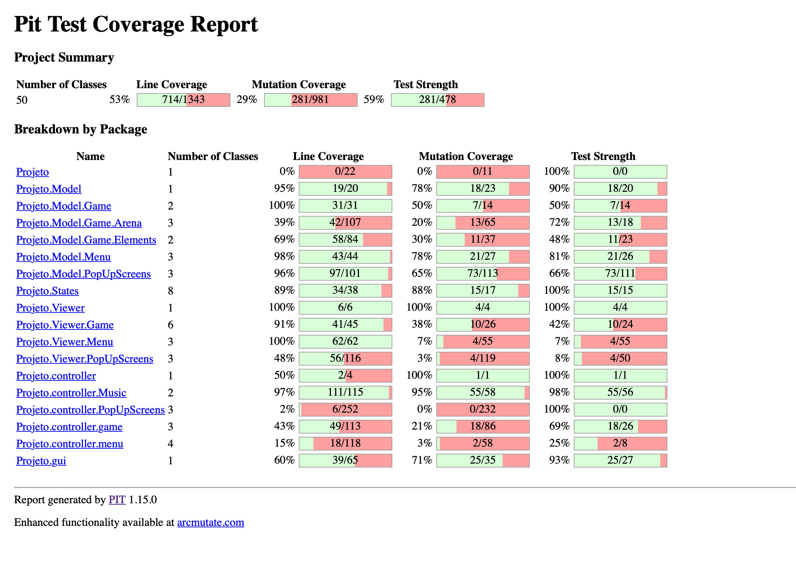

# LDTS_1404 - RUSH ROULETTE

This project was developed by *Hugo Cruz*(up202205022@fe.up.pt), *João Martinho*(up202204883@fe.up.pt) and *Tomás Telmo*(up202206091@edu.fe.up.pt) for the curricular unit LDTS 2023/24.

## GAME PRESENTATION

**Rush Roulette** is a survival-type multi-directional arcade game where you control your player with the main goal of surviving for as long as you can. 

Each level corresponds to a timer of 10 seconds, and at the beggining of each level a new enemy will be inserted into the game, making the game progressively harder as you go through the levels. Your enemies will follow all your moves with the main goal of catching you as fast as possible. In addition, you will find some coins that will boost your overall score, as well as some power-ups that can be either good or bad for your survival, that´s the fun of a good roulette ! 

This Project was developed by Hugo Cruz, João Martinho and Tomás Telmo for LDTS 2023/2024.
## DEMO

## FEATURES
### IMPLEMENTED FEATURES
* **Menu** - When the game is initialized, a Menu will appear with four different options (Play, Instructions, Leaderboard, Exit)
* **Instructions** - Quick info-dump of the game's objective, mechanics and controls
* **LeaderBoard** - holds the current 15 highest scores obtained by our Rush Roulette Players
* **Movement** - The player will be able to move in different directions as the arrows keys are pressed
* **Level** - The player must survive for 10 seconds in order to go to a new level, where new entities such as power ups, coins and enemies are added into the game. There are currently 30 unique levels in Rush Roulette
* **Enemies** - The enemies will chase every single one of your moves with the main goal of catching you as soon as they can
* **Score** - Your score will increase every time you go to a new level or with the coins you collect along the way, if its high enough you can save and immortalize it in Rush Roulette's leaderboard!
* **Coins** - Coins will be in the game to boost your overall score
* **Health Points (HP)** - Starting at 3 pts, you can earn HP in powerUps, and you can lose it when an enemy touches the player or, you guessed it, in powerUps
* **PowerUps** - This will be the fun/intriguing part fo the game, as the powerUps don´t necessarily bring good news. Each powerUp can bring you either an advantage or disadvantage to your survival, and when you decide to collect it you´re taking the risk in search of a great reward
* **Implemented PowerUps:**
  * **Invulnerability** - lasts 5 sec; the player cannot be damaged by enemies
  * **Double points** - lasts 5 sec; doubles the amount of points that each coin gives
  * **Half points** - lasts 5 sec; halves the amount of points that each coin gives
  * **HP +1** - instantaneous; increases the HP counter by 1pt
  * **HP -1** - instantaneous; decreases the HP counter by 1pt
* **Game Over** - The game will be over when your HP is equal to Zero, then a screen will pop up presenting 3 options ("Retry", "Save", "Menu")
* **Save Screen** - When you choose to save your score, this screen pops up and politely asks you to choose a display name, if you think your score is high enough, then it will appear on the leaderboard with the name you chose
* **SoundCoverage:** 
  * **Menu** - when the application opens, or when the menu option is selected, the menu soundtrack will play 
  * **Game** - when you click play the game starts with a very catchy soundtrack then, every 10 levels, a new soundtrack plays, symbolizing an increase in difficulty
  * **Coins** - there's a small arcade like sound that plays every time you pick up a coin
  * **Enemies** - a "hit" sound plays everytime an enemy touches you! try not to have that happen too many times 
  * **PowerUps** - all powerUps have unique sounds, so that the player can immediately know what powerUp they got 
  * **Victory/GameOver screen** - a unique sound / soundtrack will play when the player completes / loses the game
  * **New Level** - a small sound plays to signal that you have entered a new level
  * **Options** - a small sound plays every time you select an option on a screen
* **Timers** - a countdown timer will appear in the background to tell you the time you still have left in the level you´re currently in; there's also a different 5 sec timer for time dependant powerUps

## IMPLEMENTATION - UML

## DESIGN PATTERNS
### FACTORY METHOD
The Factory Method pattern is a design pattern that provides an interface for creating objects in a superclass, but allows the respective subclasses to alter the type of objects that will eventually be created, composed and represented, resulting in an easier abstraction

### STATE PATTERN
#### DESCRIPTION
The state pattern is a behavioral design pattern that represents each possible state of an object as a different class, and each states has its own behaviour pre-defined. In our specific case, we have a different state for each possible game situation: the one related to the game (GameState), to the menu (MenuState), to the instructions menu (InstructionsState), to the leaderboard (LeaderboardState), and now the ones that can happen after you play the game: if you loose (GameOverState), if you can successfully complete the game (VictoryState), and the one that will allow you to save your score with the name you want to appear in the leaderboard (SaveScoreState). Without this pattern, our code would be much messier and not as efficient.
#### IMPLEMENTATION

## UML COMMUNICATION DIAGRAMS
A UML communication diagram showing how the involved classes communicate during a game step when the Menu State is active:

A UML communication diagram showing how the involved classes communicate during a game step when the Menu State is active and the user selects an option:

A UML communication diagram showing how the involved classes communicate during a game step when the Game State is active:

The other existing states work in the same logic as the Game State (shown in the image above), so we didn´t think there was the need to exemplify each one individually.

## Tests

In testing, our primary focus was to cover as many methods as possible.

### Mutation testing report
In this report, the test class "NoExit" isn't included because it would prevent Pitest from terminating.

## CODE SMELLS
The main code smell there is in our code is the mode of application of the PowerUps. As we have different options of PowerUps to be applied, we realized that we should have applied the strategy pattern to deal with it. that way, it would make our code more efficient and would make it easier if we wanted to add any new functionalities to it. 

## Self Evaluation 

- Hugo Cruz : 33.3% 
- João Martinho : 33.3%
- Tomás Telmo: 33.3%
