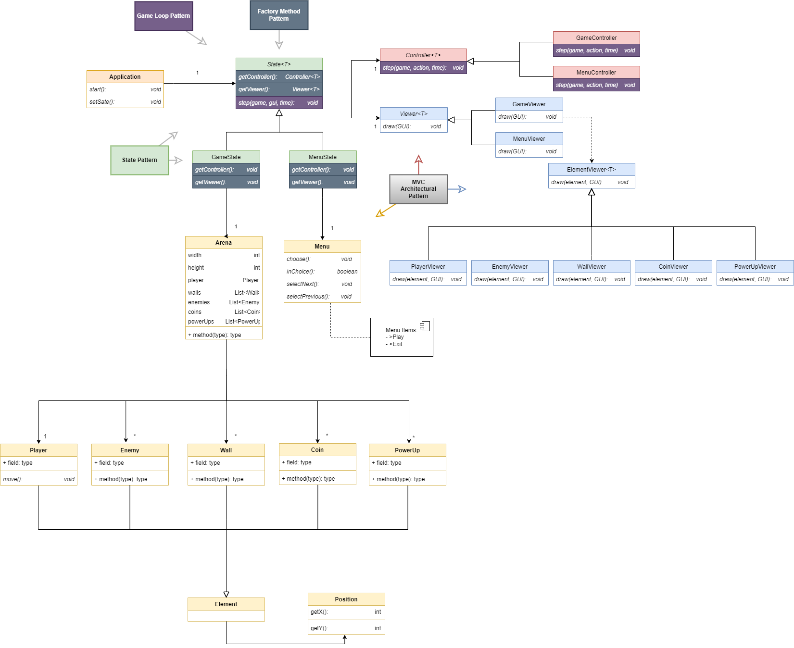

# LDTS_1404 - RUSH ROULETTE

## GAME PRESENTATION

**Rush Roulette** is a survival-type multi-directional arcade game where you control your player with the main goal of surviving for as long as you can. 

Each level corresponds to a timer of 10 seconds, and at the beggining of each level a new enemy will be inserted into the game, making the game progressively harder as you go through the levels. Your enemies will follow all your moves with the main goal of catching you as fast as possible. In addition, you will find some coins that will boost your overall score, as well as some power-ups that can be either good or bad for your survival, that´s the fun of a good roulette ! 

This Project was developed by Hugo Cruz, João Martinho and Tomás Telmo for LDTS 2023/2024.

## FEATURES
### IMPLEMENTED FEATURES
* Coming soon...
### PLANNED FEATURES
* Menu - When the game is initialized, a Menu will appear with two different option(Play and Exit)
* Movement - The player will be able to move in different directions as the arrows keys are pressed
* Level - The player must survive for 10 seconds in order to go to a new level, where new entities such as power ups, coins and enemies are added into the game
* Enemies - The enemies will chase every single one of your moves with the main goal of catching you as soon as they can
* Coins - Coins will be in the game to boost your overall score
* Power-ups - This will be the fun/intriguing part fo the game, as the power-ups don´t necessarily bring good news. Each power-up can bring you either an advantage or disadvantage to your survival, and when you decide to collect it you´re taking the risk in search of a great reward
* Score - Your score will increase according to the time and level you´re in, together with the points provided by the coins you collect along the way
* Game Over - The game will be over for you as soon as an enemy catches you
* SoundTrack - A background music will play as soon as you open the game
* Timer - A countdown timer will appear in the background to tell you the time you still have left in the level you´re currently in

## IMPLEMENTATION - UML

## DESIGN PATTERNS
In our game we used **MVC ARCHITECTURE**, combined with **FACTORY METHOD** and **STATE** patterns. 

**MVC ARCHITECTURE:** (Model, View, Controller)

-The model section contains all the data classes

-The view section is currently planned to display the models with draw methods

-The controller section is in charge of interpreting the user commands and presenting the viewer section with the necessary data for the draw methods

**STATE PATTERN:**
In order to change from the menu to the game itself during the application's runtime we decided to use the state pattern

**FACTORY METHOD PATTERN:**
Since both in the menu and in the game we need to access the corresponding viewers and controllers, and both are in different states, we decided to leave the corresponding code in an interface (State<T>). It results in an easier abstraction!  

## UML Communication Diagrams 
(to be defined)